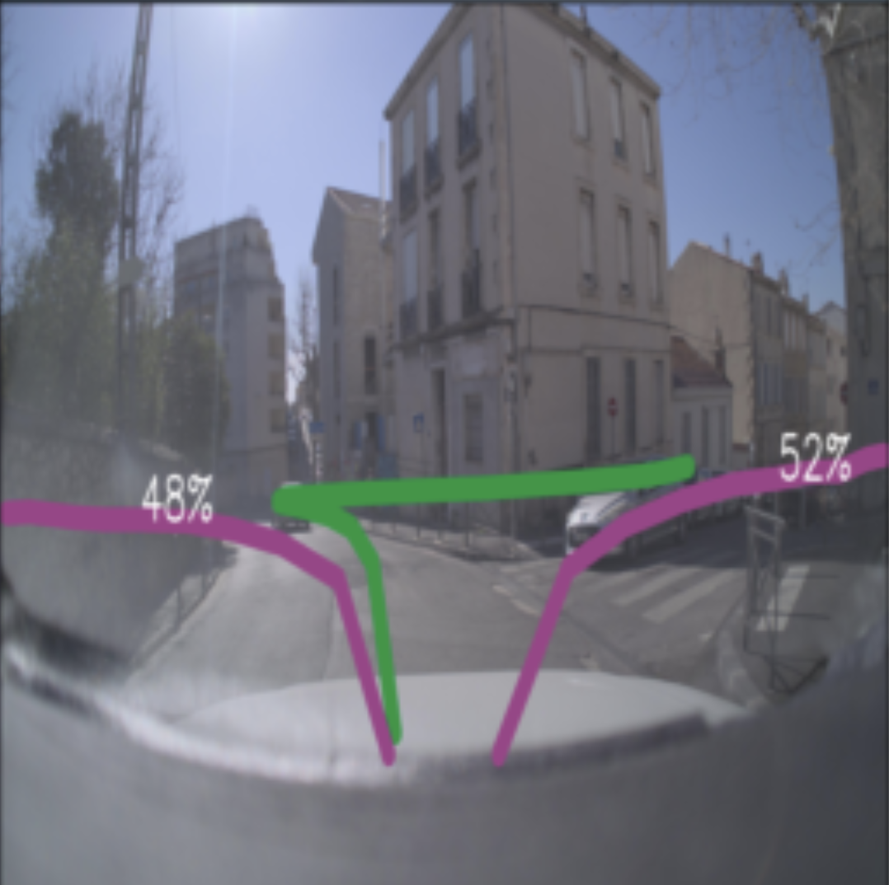

# ZOD Multi-Trajectory Pipeline

This repository provides a pipeline for training, evaluating, and visualizing multi-trajectory prediction models on the ZOD dataset.  

The method predicts multiple possible future paths that a driver may take, based on a single frontal camera image. Predictions are expressed in ground-plane coordinates (GPS) relative to the vehicle’s starting position.  

Ground truth trajectories are generated from the GPS data of where the vehicle actually traveled after each image was captured.  

For visualization, both predicted and ground-truth trajectories are projected into the **camera image plane** using calibration parameters. This overlays the paths directly on top of the corresponding camera frame, making it possible to compare predicted trajectories with the driver’s true path.


## Example Results

After training, the pipeline stores prediction visualizations in the `results/` directory.  
Here is an example of a predicted trajectory overlayed on the ZOD dataset, where purple lines are predictions and the green line is the ground truth:
<p align="center">
    
</p>

---

## Setup

### 1. Create and activate a virtual environment
```bash
python3 -m venv .venv
source .venv/bin/activate
pip install -r requirements.txt
```

### 2. Configure paths
Update dataset and model configuration in:

- `model/model_config.py`
- `dataset/zod_configs.py`

In particular, set for example:  
```python
STORED_GROUND_TRUTH_PATH = "/mnt/ZOD/ground_truth.json"
DATASET_ROOT = "/mnt/ZOD"
```

Other parameters may be left as default or modified as needed.

---

## Data Preparation

### 1. Resize images
The pipeline has been tested with images resized to **256×256**.  

Run the resize script:
```bash
python resize_and_save.py
```

Make sure `IMG_SIZE` and `DATASET_ROOT` in `dataset/zod_configs.py` are set correctly.  

Alternatively, you can work with full-sized images by setting  
`USE_PRE_RESIZED_IMGS = False` in `dataset/zod_configs.py` and skipping this step (not tested).

### 2. Generate ground truth
Ground truth is generated by looking ahead in future frames. Run the ground truth generation script:
```bash
python generate_ground_truth.py
```

This script calls utility functions defined in `dataset/groundtruth_utils.py`.  

Ensure that the path specified in `STORED_GROUND_TRUTH_PATH` in `dataset/zod_configs.py` is valid.

---

## Training & Evaluation

Run the main training script:  
`python main.py`

This will:  
- Train the model  
- Evaluate performance  
- Store example predictions in the `results/` directory  

---